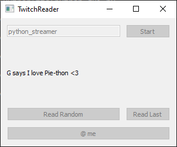

# Twitch Reader

Twitch Reader is a "Text-To-Speech" GUI application powered by [PyQt5](https://www.riverbankcomputing.com/software/pyqt/). The application can be used by a streamer to convert their chat messages from [Twitch](https://www.twitch.tv/) to speech. The application also supports filtering messages on the basis of usernames or by the start and end of messages.

## Installation

Use the package manager [pip](https://pip.pypa.io/en/stable/) to install the necessary dependencies for Twitch Reader to run.

```bash
pip install -r requirements.txt
```

## Usage
#### Setting up the app.conf file
Get Token from [Twitch](https://twitch.tv).

In the app.conf file under the "connection" section add the following entries

```cfg
token=oauth:token_from_twitch
nickname=twitch_username_for_which_the_token_was_obtained
```

The app.conf file also supports other settings that can be changed according to user preference.
The `blacklist` section in specific can be customized for filtering messages based on username or by the start and end of messages.


#### To Start the GUI
```shell
python gui.py
```



## License
[MIT](https://choosealicense.com/licenses/mit/)